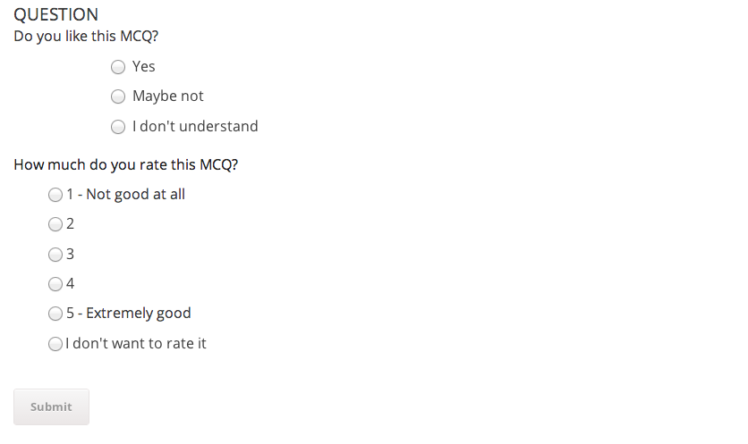
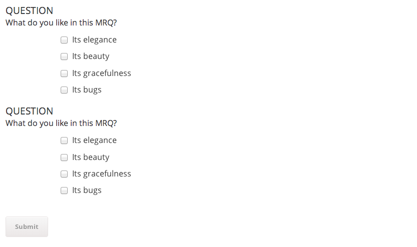
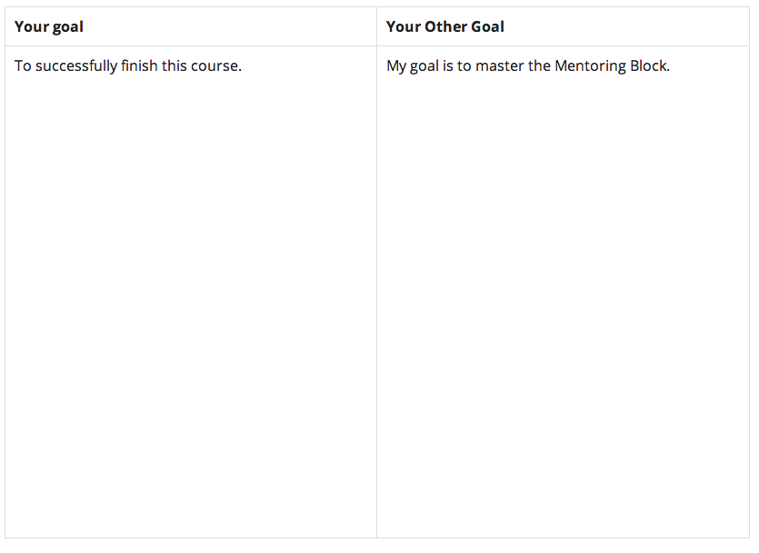

Questions and Other Components
==============================

These are the types of questions that can be added to Problem Builder and Step
Builder:

### Free-form Questions

Free-form questions are represented by a **Long Answer** component.

Example screenshot before answering the question:

Screenshot after answering the question:

You can add **Long Answer Recap** components to problem builder blocks later on
in the course to provide a read-only view of any answer that the student entered
earlier.

The read-only answer is rendered as a quote in the LMS:

### Multiple Choice Questions (MCQs)

Multiple Choice Questions can be added to a problem builder component and have
the following configurable options:

* **Question** - The question to ask the student
* **Message** - A feedback message to display to the student after they have
  made their choice.
* **Weight** - The weight is used when computing total grade/score of the
  problem builder block. The larger the weight, the more influence this question
  will have on the grade. Value of zero means this question has no influence on
  the grade (float, defaults to `1`).
* **Correct Choice[s]** - Specify which choice[s] are considered correct. If a
  student selects a choice that is not indicated as correct here, the student
  will get the question wrong.

Using the Studio editor, you can add **Custom Choice** blocks to an MCQ. Each
Custom Choice represents one of the options from which students will choose
their answer.

You can also add **Tip** entries. Each Tip must be configured to link it to one
or more of the choices. If the student selects a choice, the tip will be
displayed.

**Screenshots**

Before attempting to answer the questions:

While attempting to complete the questions:

After successfully completing the questions:

#### Rating Questions

When constructing questions where the student rates some topic on the scale from
`1` to `5` (e.g. a Likert Scale), you can use the Rating question type, which
includes built-in numbered choices from 1 to 5. The `Low` and `High` settings
specify the text shown next to the lowest and highest valued choice.

Rating questions are a specialized type of MCQ, and the same instructions apply.
You can also still add **Custom Choice** components if you want additional
choices to be available such as "I don't know".

### Multiple Response Questions (MRQs)

Multiple Response Questions are set up similarly to MCQs. The answers are
rendered as checkboxes. Unlike MCQs where only a single answer can be selected,
MRQs allow multiple answers to be selected at the same time.

MRQ questions have these configurable settings:

* **Question** - The question to ask the student
* **Required Choices** - For any choices selected here, if the student does
  *not* select that choice, they will lose marks.
* **Ignored Choices** - For any choices selected here, the student will always
  be considered correct whether they choose this choice or not.
* Message - A feedback message to display to the student after they have made
  their choice.
* **Weight** - The weight is used when computing total grade/score of the
  problem builder block. The larger the weight, the more influence this question
  will have on the grade. Value of zero means this question has no influence on
  the grade (float, defaults to `1`).
* **Hide Result** - If set to `True`, the feedback icons next to each choice
  will not be displayed (This is `False` by default).

The **Custom Choice** and **Tip** components work the same way as they do when
used with MCQs (see above).

**Screenshots**

Before attempting to answer the questions:

While attempting to answer the questions:

After clicking on the feedback icon next to the "Its bugs" answer:

After successfully completing the questions:

### Completion Questions

Completion questions allow course authors to ask learners whether they completed
an offline activity.

They have these configurable settings:

* **Question** - Mentions a specific activity and asks the student whether they completed it.
* **Answer** - Represents the answer that the student can (un-)check to indicate
  whether they completed the activity that the question mentions.

Learners can not get a completion question wrong; any answer is considered correct
once the learner submits it.

**Screenshots**

Before submitting answer:

After submitting answer (leaving checkbox unchecked is a valid answer):

Other Components
================

### Tables

Tables allow you to present answers to multiple free-form questions in a concise
way. Once you create an **Answer Recap Table** inside a Mentoring component in
Studio, you will be able to add columns to the table. Each column has an
optional **Header** setting that you can use to add a header to that column.
Each column can contain one or more **Answer Recap** elements, as well as HTML
components.

Screenshot:

### "Dashboard" Self-Assessment Summary Block

[Instructions for using the "Dashboard" Self-Assessment Summary Block](Dashboard.md)
